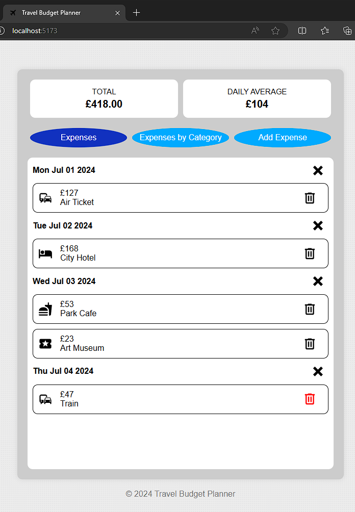
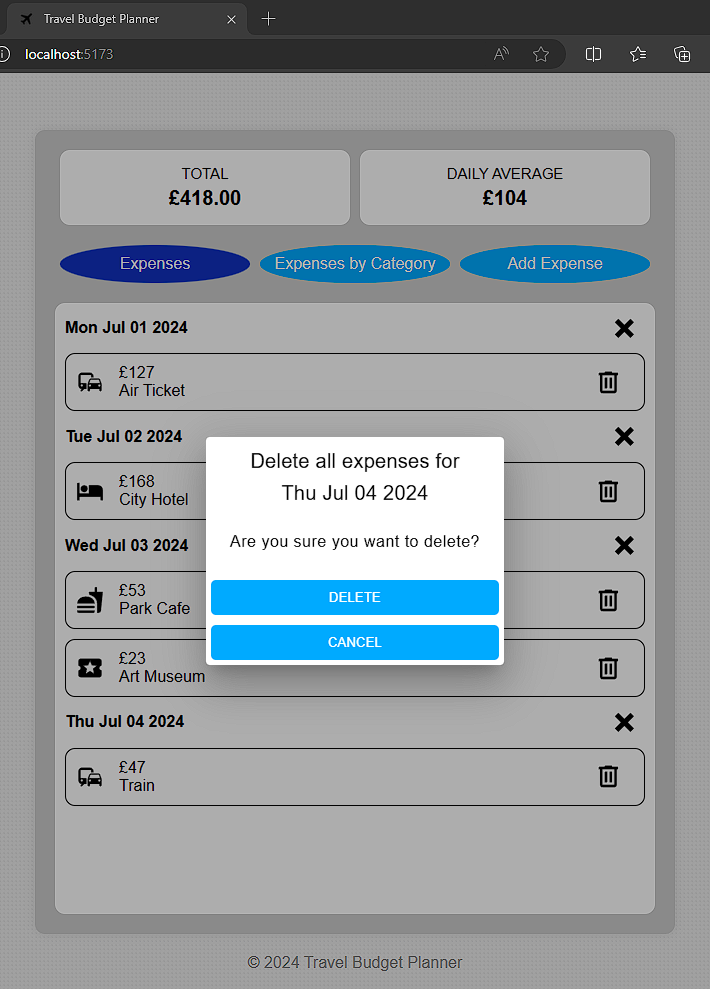
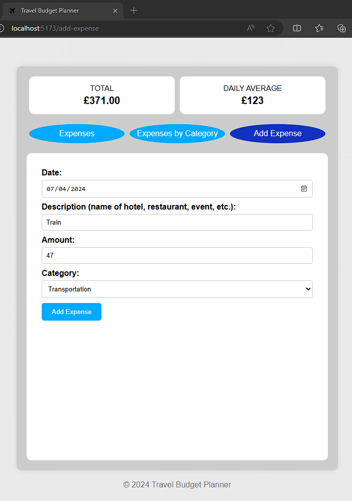
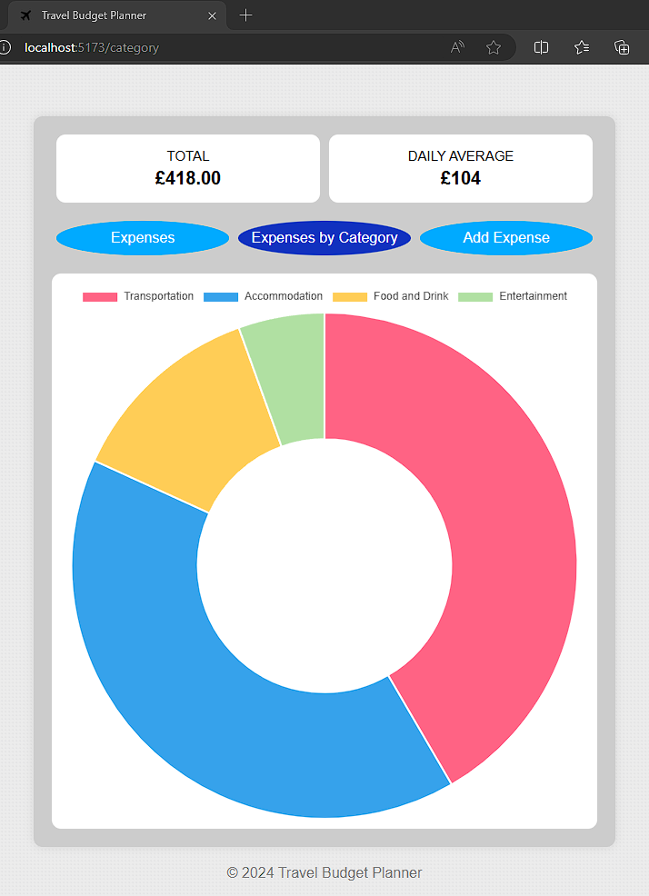
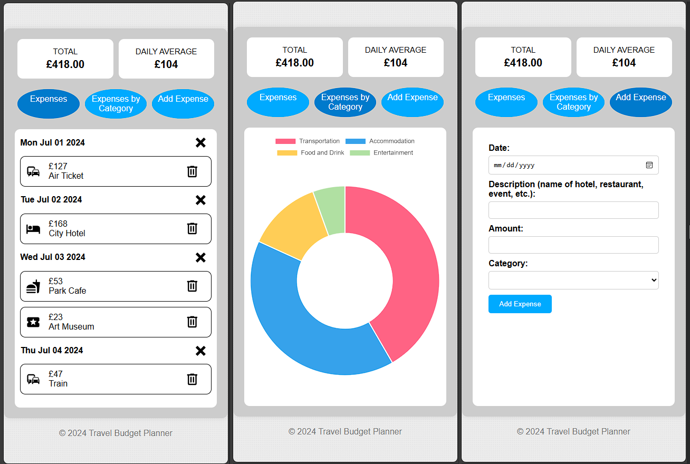

# Vue 3 - Travel Budget Planner

## Overview

Travel Budget Planner is designed to help users plan and manage their travel expenses effectively. Users can add expenses, categorize them, view a summary of their spending, and analyze their expenses with a doughnut chart.

This is a Single Page Application (SPA) built with Vue.js. SPAs offer a smoother, faster user experience by loading a single HTML page and dynamically updating the content as the user interacts with the app, without requiring full page reloads.

## Features

- **Add Expenses**: Users can add travel expenses by specifying the date, description, amount, and category.
- **Expense List**: View all added expenses sorted by date.
- **Total and Daily Average**: Display total expenses and daily average expenses.
- **Category-wise Analysis**: Visual representation of expenses by category using a doughnut chart.
- **Delete Expenses**: Delete individual expenses or all expenses for a specific date.

## Project Structure

```plaintext
travel-budget-planner
├── node_modules
├── public
├── src
│ ├── assets
│ │ └── main.css
│ ├── components
│ │ ├── AddExpenseForm.vue
│ │ ├── DoughnutChart.vue
│ │ ├── ExpensesList.vue
│ │ ├── ExpensesLists.vue
│ │ ├── Footer.vue
│ │ ├── Nav.vue
│ │ └── TotalAverage.vue
│ ├── router
│ │ └── index.js
│ ├── views
│ │ ├── AddExpense.vue
│ │ ├── CategoryExpenses.vue
│ │ └── HomeView.vue
│ ├── App.vue
│ ├── main.js
│ └── store.js
├── index.html
├── package.json
├── vite.config.js
└── README.md
```

## Installation

To install and run this project locally, follow these steps:

1. Clone the repository:

```sh
git clone https://github.com/yourusername/travel-budget-planner.git
cd travel-budget-planner
```

2. Install the dependencies:

```sh
npm install
```

3. Start the development server:

```sh
npm run dev
```

4. Open your browser and navigate to http://localhost:5173 to view the app.

## Usage

### Home View

- Displays a summary of total and daily average expenses.
- Provides buttons to navigate through expenses list, doughnut chart and add expense form.
- Lists all added expenses sorted by date.
- Users have the options to delete a particular expense, or all expenses for a specific date.





### Add Expense

- Users could add a new expense with fields for date, description, amount, and category.



### Category Expenses

- Visual representation of expenses by category using a doughnut chart.



## Routing

The app uses Vue Router for navigation:

- `/`: Home view displaying the list of expenses and summary.
- `/add-expense`: Form to add a new expense.
- `/category`: Visual representation of expenses by category.

## State Management

The app uses a simple store for state management (store.js). The state includes the list of expenses and functions to save and retrieve the state.

## Dependencies

- Vue Toastification: Provides toast notifications for user interactions.
- Chart.js: Used for data visualization in the doughnut chart component.
- Vuetify: A Material Design component framework used for styling and layout components like v-dialog and v-card.

## Responsive Design

Travel Budget Planner is designed with a responsive layout, ensuring a seamless experience across various devices and screen sizes.



## License

This project is licensed under the MIT License.

## Acknowledgements

- [Vue.js](https://vuejs.org/)
- [Vue Router](https://router.vuejs.org/)
- [Vue Toastification](https://vue-toastification.maronato.dev/)
- [Chart.js](https://www.chartjs.org/)
- [Vuetify](https://vuetifyjs.com/en/)
- [Vite](https://vitejs.dev/)
